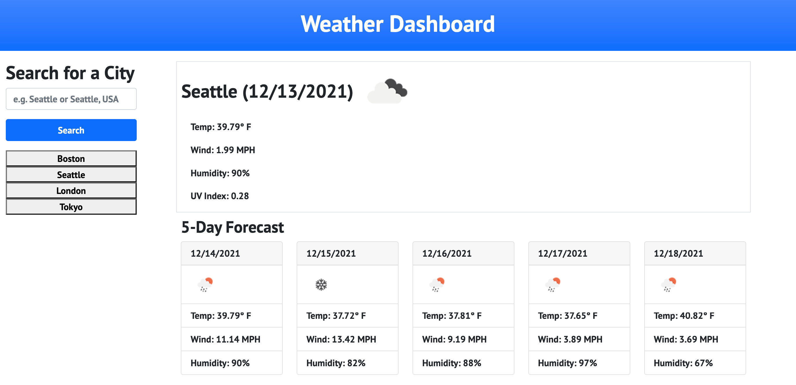
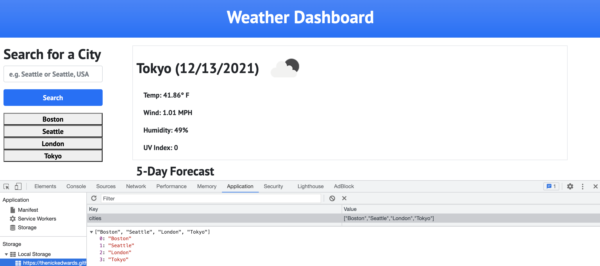

# weather-dashboard
Homework 06 Server-Side APIs: Weather Dashboard - Create weather API

Weather Dashboard page created per acceptance criteria in [W6-hw_readme.md](W6-hw_readme.md).

## Work Done
* Weather Dashboard created and live
* Page has form inputs
* When user searches city, current and future conditions for that city displayed and city added to search history
* When viewing current weather conditions city name, date, weather conditions icon, temperature, humidity, wind speed and UV index presented
* When viewed UV index rendered with color that indicates whether the conditions are favorable, moderate, or severe
* Future weather conditions presented as 5-day forecase with date, wether conditions icon, temperature, wind speed and humidity
* When a city in search history clicked, user is presented with current and future weather conditions for that city again

## Links
URL for published page: https://thenickedwards.github.io/weather-dashboard/

URL for GitHub repo: https://github.com/thenickedwards/weather-dashboard

## Screenshots of Page(s)

